# SentinelShield: Linux Security Hardening and Threat Audit Framework

## Overview

SentinelShield is a Bash-based Linux security auditing and hardening framework built for academic and defensive cybersecurity practice. It provides a terminal-based interface for running Linux security checks, validating SSH security policies, scanning open ports, reviewing SUID/SGID binaries, checking enabled/running services, applying SSH hardening, rolling back SSH configuration backups, generating security reports, and demonstrating CPU scheduling concepts.

The tool uses "whiptail" to provide a menu-driven terminal UI.

## Key Features

- Basic Linux security scan
- World-writable file and directory checks
- Sticky-bit check for risky common directories
- SSH policy validation using an INI policy file
- Open/listening ports scan using `ss` or `netstat`
- SUID/SGID binary scan
- Enabled and running services review
- SSH hardening with automatic backup
- SSH configuration rollback from backup
- Security report generation with score and log
- Manual configuration backup
- CPU scheduling algorithms: FCFS, SJF, Round Robin
- CPU scheduling demo using `renice`

## Technologies Used

- Bash scripting
- Linux
- Whiptail terminal UI
- SSH configuration hardening
- System security auditing
- File permission auditing
- Service inspection
- Port scanning
- CPU scheduling simulation

## Requirements

Install required tools:

```bash
sudo apt update
sudo apt install -y whiptail iproute2 net-tools procps
```

## Documentation

- [Project Presentation](docs/sentinelshield-presentation.pdf)


  ## Screenshots

### Main Menu
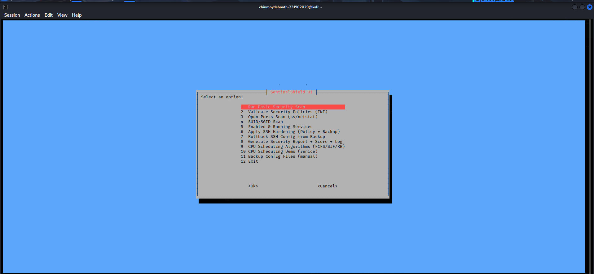

### Basic Security Scan
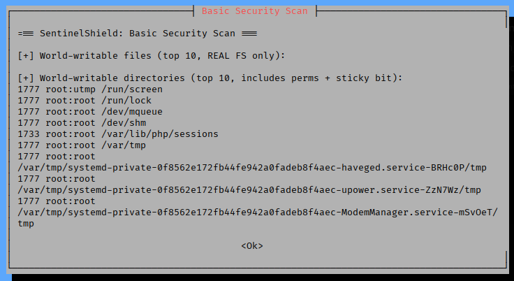

### Policy Validation
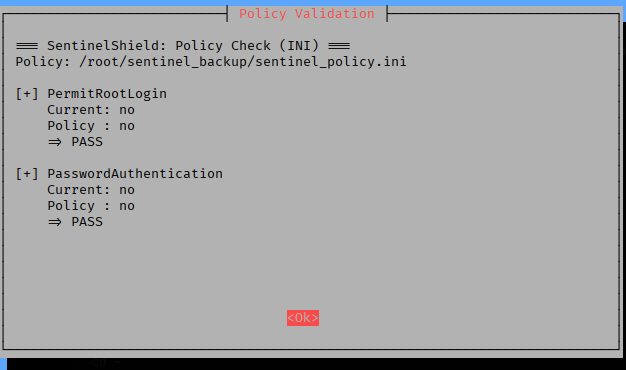

### Open Ports Scan
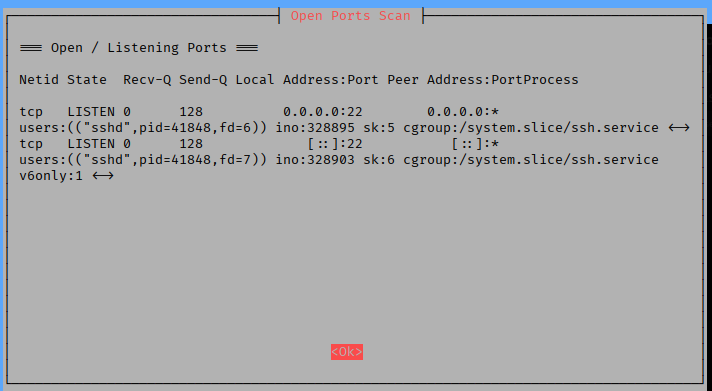

### SUID/SGID Scan
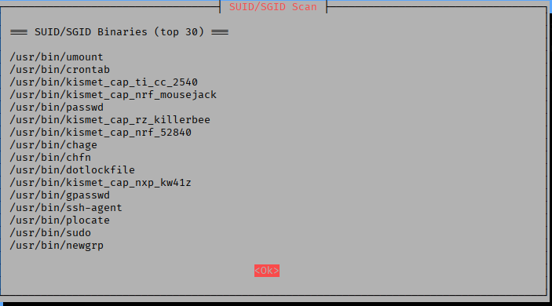

### Services Overview
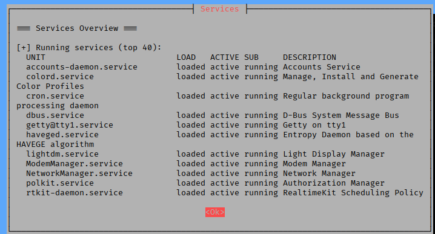

### SSH Hardening
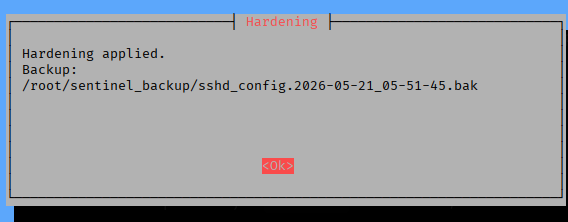

### Rollback from Backup
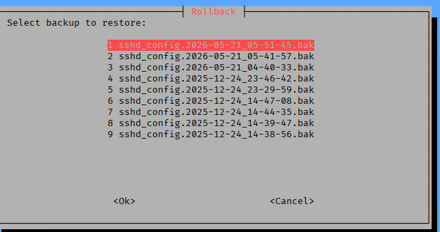

### Security Report Generated
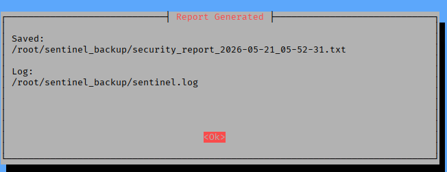

### CPU Scheduling Algorithms
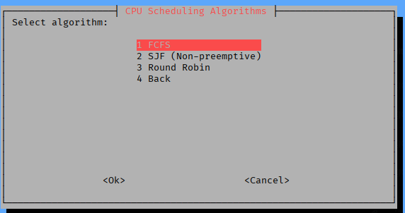

### Scheduling Sample Output
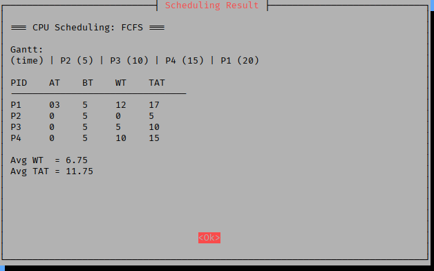

### CPU Scheduling Demo
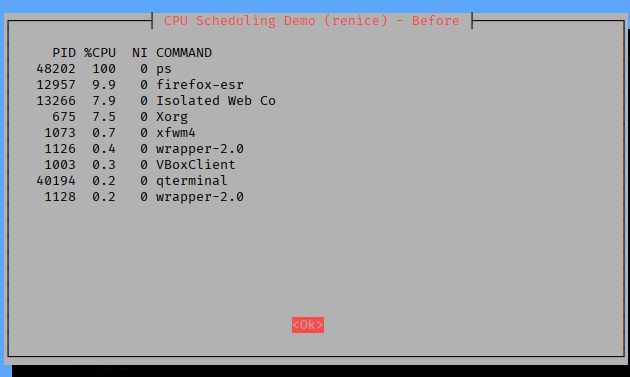

### Backup Created
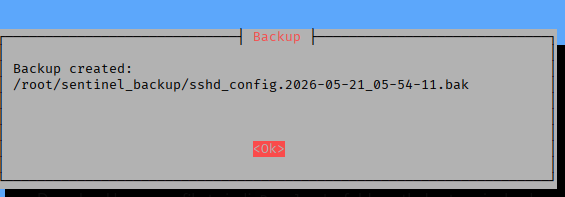

